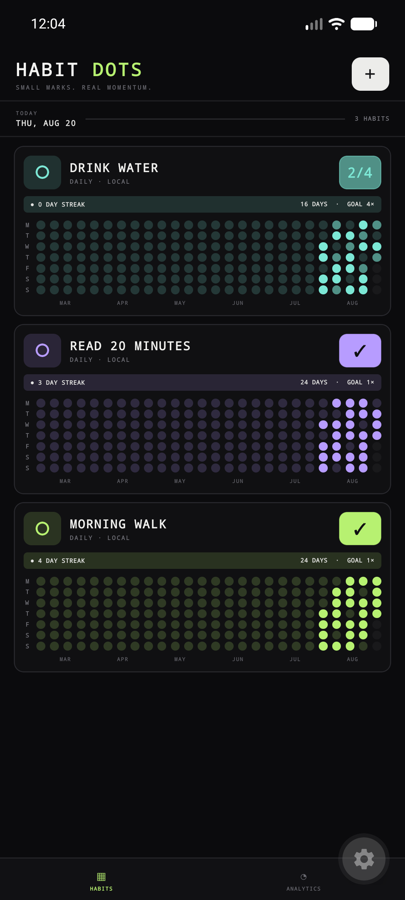
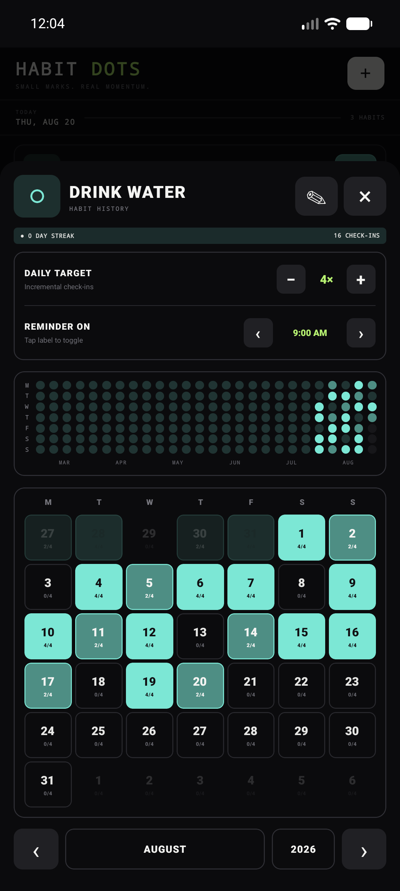
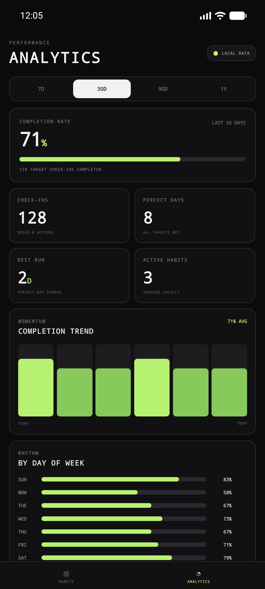

<div align="center">
  

  # HabbitDot

  **A private, offline-first habit tracker built for consistency—not attention.**

  Track daily habits, set multi-check-in goals, schedule smart reminders, and understand your progress. No account, no ads, and no cloud database.

  [](https://github.com/shivardev/HabbitDot/releases/latest/download/HabbitDot.apk)

  [](https://github.com/shivardev/HabbitDot/releases/latest)
  [](https://github.com/shivardev/HabbitDot/actions/workflows/ci.yml)
  [](LICENSE)
  [](https://docs.expo.dev/versions/v57.0.0/)
</div>

## See it in action

<p align="center">
  
  &nbsp;
  
  &nbsp;
  
</p>

<p align="center"><sub>Demo data only. HabbitDot never uploads your habit names or history.</sub></p>

## Why HabbitDot?

- **Fast daily check-ins** — record progress with one tap, including goals from 1× to 20× per day.
- **Reminders that understand your goal** — schedule multiple exact-time reminders; they stop after today's target is complete.
- **History you can read at a glance** — contribution grids and monthly calendars show both partial and completed days.
- **Useful local analytics** — review completion rate, perfect days, streaks, trends, weekdays, and per-habit performance.
- **Private by design** — your data stays in the app's local SQLite database. There is no account, telemetry, advertising, or analytics SDK.
- **Works offline** — the core experience needs no backend and no internet connection.

## Download for Android

### [Download the latest APK →](https://github.com/shivardev/HabbitDot/releases/latest/download/HabbitDot.apk)

On Android, allow installation from your browser or file manager when prompted, then open the downloaded `HabbitDot.apk`. Existing users can install a newer APK over the current app to preserve local history. Uninstalling HabbitDot removes its on-device data.

> iOS builds are not distributed here. Developers can run the iOS project locally with Xcode.

## Technology

| Layer | Choice |
| --- | --- |
| App | React Native 0.86 + React 19 |
| Toolchain | Expo SDK 57 + Continuous Native Generation |
| Language | Strict TypeScript |
| Storage | `expo-sqlite` |
| Reminders | `expo-notifications` |
| Time input | Native date/time picker |

## Run locally

Requirements: Node.js 22 or newer, npm, and either Expo Go or an Android/iOS native toolchain.

```sh
git clone https://github.com/shivardev/HabbitDot.git
cd HabbitDot
npm ci
npm run check
npm start
```

Scan the displayed QR code with Expo Go for quick UI development. Expo Go has a separate sandboxed database from an installed HabbitDot build.

For an Android development build:

```sh
npm run android
```

Local notification behavior should be tested in an installed development or release build. HabbitDot does not use remote push notifications.

## Build an installable APK

The `preview` EAS profile produces an APK, while the `production` profile produces the Android store artifact.

```sh
npm install --global eas-cli
eas login
eas build --platform android --profile preview
```

To publish a downloaded build as a GitHub release:

```sh
gh release create v1.0.0 ./HabbitDot.apk \
  --repo shivardev/HabbitDot \
  --title "HabbitDot v1.0.0" \
  --notes-from-tag
```

The native `android/` and `ios/` folders are generated by Expo and intentionally not committed.

## Project structure

```text
App.tsx                    App shell, habit screens, and navigation
src/AnalyticsScreen.tsx    On-device analytics dashboard
src/database.ts            SQLite schema, migrations, and repositories
src/notifications.ts       Reminder scheduling and notification actions
assets/                    App icons and brand assets
docs/                      Architecture notes and product screenshots
```

Read [Architecture](docs/ARCHITECTURE.md) for the data flow and design decisions, and [Privacy](PRIVACY.md) for the plain-language privacy policy.

## Contributing

Contributions are welcome. Please read [CONTRIBUTING.md](CONTRIBUTING.md) before opening a pull request. Report security-sensitive issues according to [SECURITY.md](SECURITY.md).

## License

HabbitDot is open source under the [MIT License](LICENSE).
